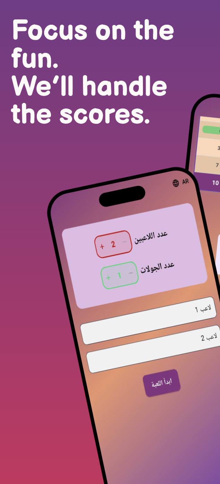
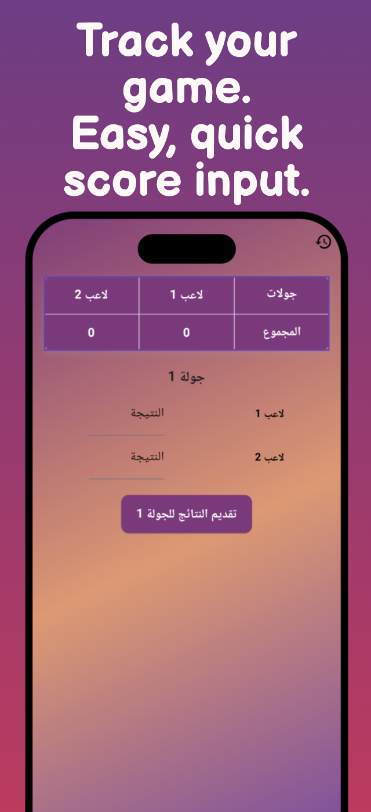

# Skrew Calculator

🎮 A mobile app for tracking multiplayer game scores using Flutter.

## ✨ Key Features

- Minimalist UI for fast scoring
- Real-time round-based game tracking
- History of previous games
- Ranking logic and low-score highlights
- Reset and new session options

## 🔧 Tech Stack

- Flutter
- Firebase (Realtime Database)
- Dart

## 📱 Screenshots

|  |  |  |
| :---------------------------------------: | :---------------------------------------: | :---------------------------------------: |
|  |  |

## 🔗 Download

Available now on Google Play Store!

## 💬 Contact

For collaboration or feedback, reach out at: kirolos.esmat10@gmail.com
