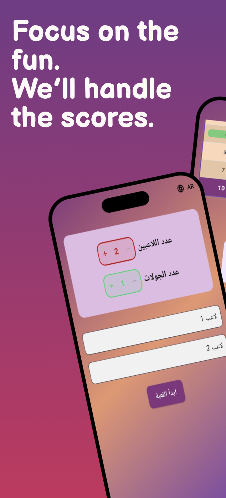
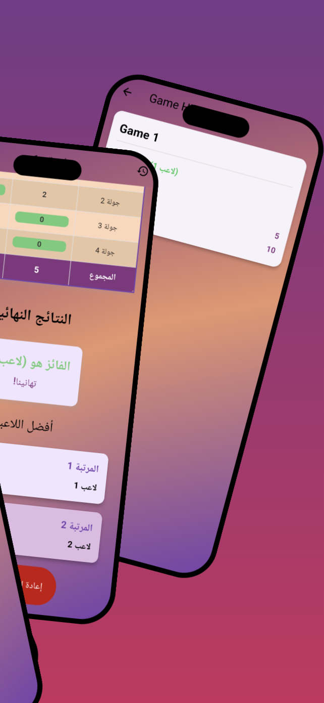
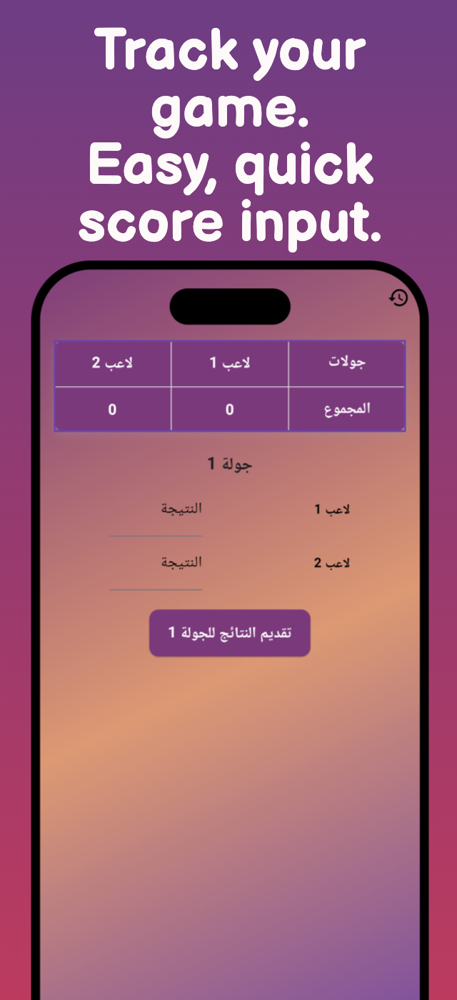
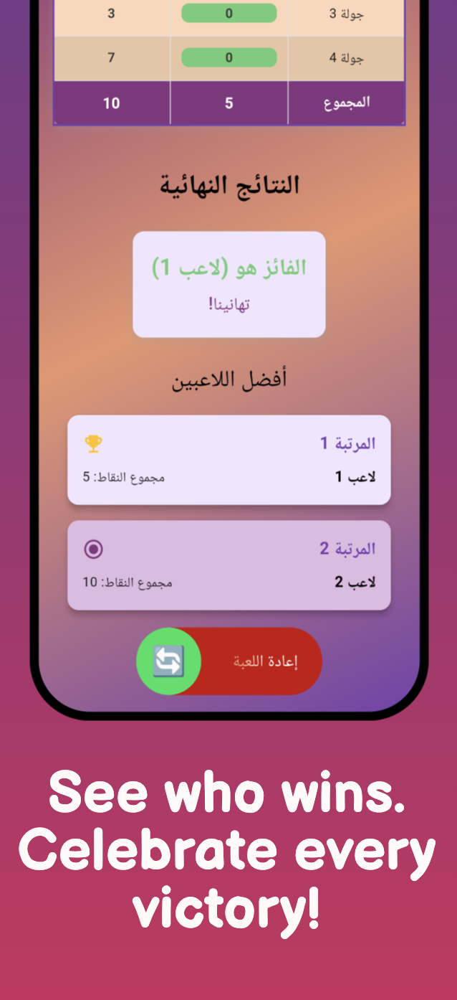
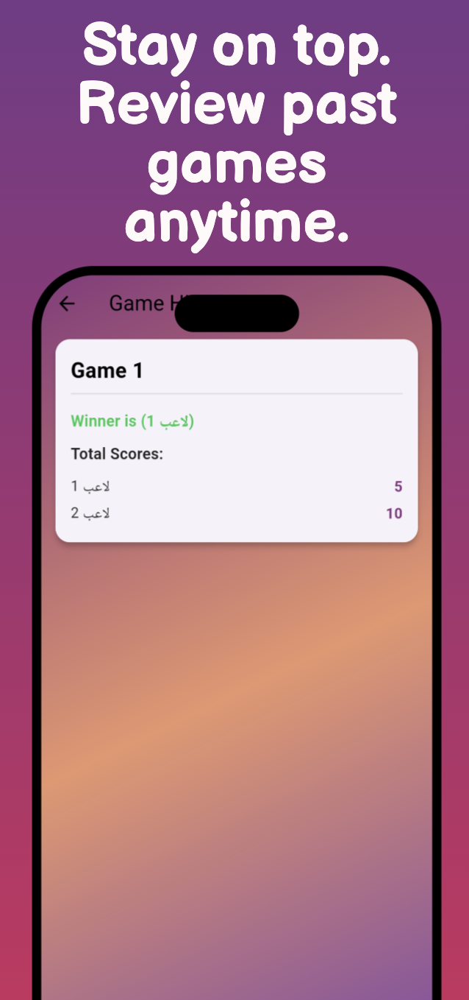

# Skrew Calculator · حاسبة سكرو

[العربية](README.ar.md) · [Google Play](https://play.google.com/store/apps/details?id=com.Hedwig.scrow_calculator)

Keep game night moving—not the scorekeeping. Skrew Calculator is a friendly companion for Skrew card games: create a game, add players, enter round scores, and review the final standings and saved history when the cards are down.

Whether you are playing in Arabic or English, the app keeps each round clear so everyone can stay focused on the fun.

## A quick look

  
  
  
  
  

## Features

- Set up games for 2–10 players and 1–10 rounds.
- Add scores one round at a time, with handy `2×` and `4×` controls when you need them.
- See player standings and celebrate the winner when the game ends.
- Look back at completed games and past winners whenever you like.
- Switch comfortably between Arabic and English.
- Play on a clear, touch-friendly mobile interface made for the table.

## Get the app

## Feedback

For feedback or collaboration, contact [kirolos.esmat10@gmail.com](mailto:kirolos.esmat10@gmail.com).

## License

This project is proprietary. See [LICENSE](LICENSE); all rights are reserved by Hedwig Devs.
